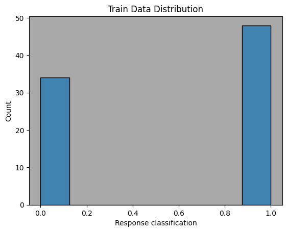
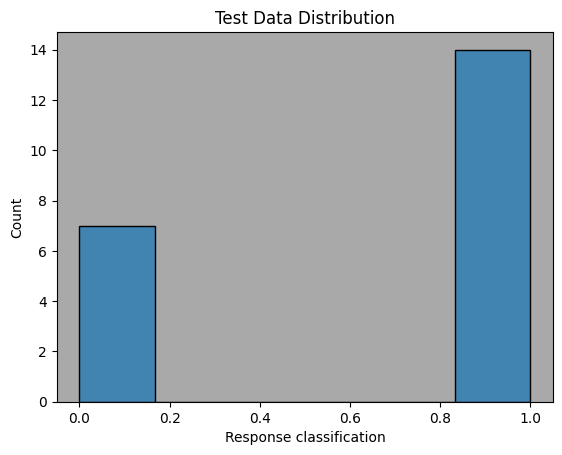
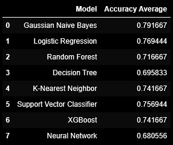
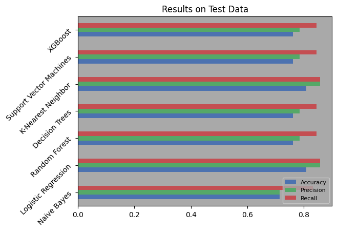
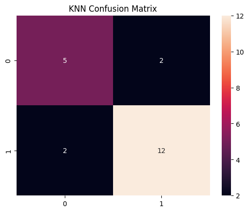
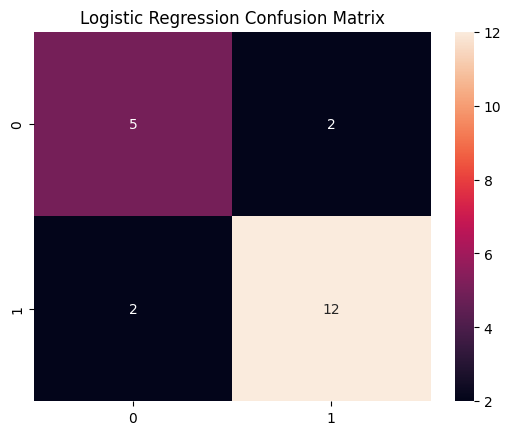
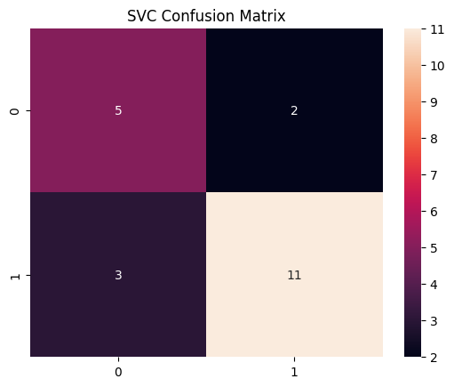

# BinaryClassification
## 	:warning: Disclaimer
This is a continuation of the [Sentiment Analysis](https://github.com/BryceDecker/SentimentAnalysis) project. Therefore, our motivation has been established and the data is ready for analysis. 

## 🛈 Background Information
Binary classification is a machine learning technique used to categorize data into two distinct classes or categories. It has been extensively applied in various domains, including spam detection, disease diagnosis, sentiment analysis, and fraud detection. By leveraging historical data and training algorithms, binary classification models are able to make predictions and classify new instances into one of the two predefined classes with high accuracy.

## 🎯 Aim
The primary objective of this project is to utilize binary classification techniques to predict whether LeBron's response tone leans towards being more neutral or more positive. As mentioned, these techniques are widely employed in sentiment analysis tasks!

Our aim is to identify models that exhibit the highest accuracy across different random states. The question that arises is: How accurate can we actually be in predicting LeBron's response tone?

## 📁 Datasets
[Interview data](https://github.com/BryceDecker/BinaryClassification/blob/main/Interview_analysis_final.csv)

## :children_crossing: Walkthrough 
We begin by splitting our data into testing and training groups. We then create seperate variations of these groups, one of which has been standardized and the other normalized. This is important to ensure the highest accuracy in our models. (note: be sure to standardize/normalize after splitting the data to prevent data leakage!) 

 

Our split distributions are similar enough to proceed. We will test the following classification techniques: Gaussian Naive Bayes (GNB), Logistic Regression (LR), Decision Tree, K-Nearest Neighbors (KNN), Random Forest, Support Vector Classification (SVC), XGBoost Classifier, and a Keras Neural Network (NN). To enhance the accuracy of our model training process and lessen the impact of an uneven distribution of tone types, we employ stratified k-folds. This technique enables us to train the models more effectively by maintaining the proportional representation of each tone type within the training folds. Also, we will be comparing each model utilizing their cross validation score. Training Summary:

We employed all of our models, with the exception of the neural network, on our test data set with each scaler applied (none, standardscaler, and normalizer) and identified the best results from each model. 

We conclude with taking a closer look at our best performing models results in the form of confusion matrices.

 
  

## :closed_book: Conclusion
With our data set on the smaller size we identified logistic regression (LR) and SVC as viable techniques. To identify the best performing binary classification method, we tested eight different techniques. Among them, Support Vector Classifier (SVC), Logistic Regression (LR), and K-Nearest Neighbors (KNN) consistently emerged as top performers. When evaluating results on different random states (for test-train-split), we identified a trend between test data which had larger amounts of 'more positive' data points and higher accuracy on the test data set. Ultimatively, we saw accuracy ranging from 70% up to 90%+ on the train and test data. For our random state (= 2), we obtained 80.95% accuracy using our LR and KNN models and 76.19% accuracy using the SVC model on our test data. These values are in excess of 25% more accurate than choosing 'more positive' every time and given our limitations on features (due to practice interviews having no associated statistics unlike post-game interviews) we find these results to be fairly strong.

## :construction: Improvements

We are aware that removing practice interviews from the data would yield much higher accuracy scores, as we identified in the Sentiment Analysis project. Removing practice day interviews would allow us to include game stats which could offer further improvements through identifying additional important features.

More data, more data, and more data. Also, testing more random states - even consider doing it iteratively and analyzing these results. (note: we created a file of random state results - e.g. more states were tested than seen in the code file.)
